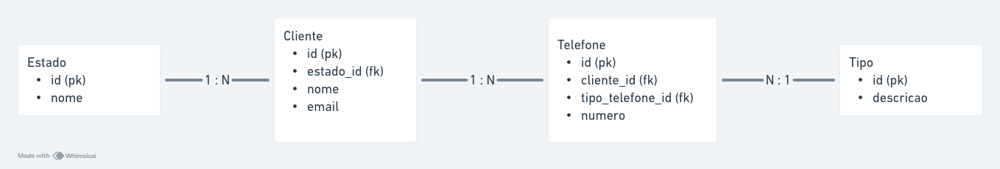

1) Observe o trecho de código:

int INDICE = 12, SOMA = 0, K = 1;

enquanto K < INDICE faça

{ K = K + 1;  SOMA = SOMA + K;}

imprimir(SOMA);

<b>Resposta:</b> 77


Ao final do processamento, qual será o valor da variável SOMA?


2) Descubra a lógica e complete o próximo elemento:

a) 1, 3, 5, 7, _9_

b) 2, 4, 8, 16, 32, 64, _128_

c) 0, 1, 4, 9, 16, 25, 36, _49_

d) 4, 16, 36, 64, _100_

e) 1, 1, 2, 3, 5, 8, _13_

f) 2,10, 12, 16, 17, 18, 19, _20_


3) Dado um vetor que guarda o valor de faturamento diário de uma distribuidora de todos os dias de um ano, faça um programa, na linguagem que desejar, que calcule e retorne:

- O menor valor de faturamento ocorrido em um dia do ano;
- O maior valor de faturamento ocorrido em um dia do ano;
- Número de dias no ano em que o valor de faturamento diário foi superior à média anual.

a) Considerar o vetor já carregado com as informações de valor de faturamento.

b) Podem existir dias sem faturamento, como nos finais de semana e feriados. Estes dias devem ser ignorados no cálculo da média.

c) Utilize o algoritmo mais veloz que puder definir.

<b>Resposta:</b> Resposta está na classe CompanyRevenue dentro de src

4) Banco de dados

Uma empresa solicitou a você um aplicativo para manutenção de um cadastro de clientes. Após a reunião de definição dos requisitos, as conclusões foram as seguintes:

- Um cliente pode ter um número ilimitado de telefones;
- Cada telefone de cliente tem um tipo, por exemplo: comercial, residencial, celular, etc. O sistema deve permitir cadastrar novos tipos de telefone;
- A princípio, é necessário saber apenas em qual estado brasileiro cada cliente se encontra. O sistema deve permitir cadastrar novos estados;

Você ficou responsável pela parte da estrutura de banco de dados que será usada pelo aplicativo. Assim sendo:

- Proponha um modelo lógico para o banco de dados que vai atender a aplicação. Desenhe as tabelas necessárias, os campos de cada uma e marque com setas os relacionamentos existentes entre as tabelas;
- Aponte os campos que são chave primária (PK) e chave estrangeira (FK);
- Faça uma busca utilizando comando SQL que traga o código, a razão social e o(s) telefone(s) de todos os clientes do estado de São Paulo (código “SP”);

<b>Resposta:</b>


```
  SELECT c.id, c.nome, t.numero
  FROM Cliente c
  INNER JOIN Estado e ON e.id = c.estado_id AND e.nome = 'SP'
  INNER JOIN Telefone t ON t.cliente_id = c.id;
```

5) Dois veículos, um carro e um caminhão, saem respectivamente de cidades opostas pela mesma rodovia. O carro, de Ribeirão Preto em direção a Barretos, a uma velocidade constante de 90 km/h, e o caminhão, de Barretos em direção a Ribeirão Preto, a uma velocidade constante de 80 km/h. Quando eles se cruzarem no percurso, qual estará mais próximo da cidade de Ribeirão Preto?

a) Considerar a distância de 125km entre a cidade de Ribeirão Preto <-> Barretos.
b) Considerar 3 pedágios como obstáculo e que o carro leva 5 minutos a mais para passar em cada um deles, pois ele não possui dispositivo de cobrança de pedágio.
c)Explique como chegou no resultado. 

<b>Resposta: </b>
Dois veículos, um carro e um caminhão, saem de cidades opostas em uma rodovia. O carro viaja de Ribeirão Preto a Barretos a 90 km/h, enquanto o caminhão faz o caminho inverso a 80 km/h. A distância entre as cidades é de 125 km, e a velocidade relativa entre eles é de 170 km/h. Sem obstáculos, eles se cruzariam em cerca de 44,1 minutos, mas o carro enfrenta um atraso de 15 minutos por causa de 3 pedágios, totalizando 59,1 minutos para o cruzamento.

Apesar desse tempo adicional para o carro, no momento em que os veículos se cruzarem, ambos estarão à mesma distância de Ribeirão Preto. Isso ocorre porque, independentemente de obstáculos ou da diferença nas velocidades, eles se encontram no mesmo ponto da estrada, garantindo que estejam igualmente distantes de Ribeirão Preto.